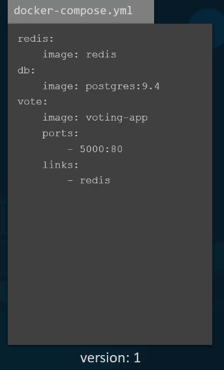

# Docker for Absolute Beginners

## Docker Overview

Image - An Image is a package or a template which is used to craete one or more containers.

Containers - These are running instances of images that are isolated that have their own environment and set of processes.

With docker, the dev team can now have the docker file with all their requirements then this Docker file will be used to create an image for their application.
This image can now on any host with docker installed in it and the ops team can deploy this image in production.

## Getting started with docker

link: <https://docs.docker.com/engine/install/ubuntu/>

OS requirements
To install Docker Engine, we need the 64-bit version of one of these Ubuntu versions:

Ubuntu Kinetic 22.10
Ubuntu Jammy 22.04 (LTS)
Ubuntu Focal 20.04 (LTS)
Ubuntu Bionic 18.04 (LTS)

Uninstall old versions:

```shell
sudo apt-get remove docker docker-engine docker.io containerd runc
```

### Install using the repository

#### Set up the repository

* Update the apt package index and install packages to allow apt to use a repository over HTTPS:

 ```shell
 sudo apt-get update
 sudo apt-get install \
    ca-certificates \
    curl \
    gnupg \
    lsb-release
```

* Add Docker’s official GPG key:

 ```shell
 sudo mkdir -p /etc/apt/keyrings
 curl -fsSL https://download.docker.com/linux/ubuntu/gpg | sudo gpg --dearmor -o /etc/apt/keyrings/docker.gpg
 ```

* Use the following command to set up the repository:

 ```shell
 echo \

  "deb [arch=$(dpkg --print-architecture) signed-by=/etc/apt/keyrings/docker.gpg] <https://download.docker.com/linux/ubuntu> \
  $(lsb_release -cs) stable" | sudo tee /etc/apt/sources.list.d/docker.list > /dev/null
```

#### Get the docker engine

* Update the apt package index:

 ```shell
 sudo apt-get update
 ```

* Install Docker Engine, containerd, and Docker Compose.

 ```shell
 sudo apt-get install docker-ce docker-ce-cli containerd.io docker-buildx-plugin docker-compose-plugin
 ```

* Check installation:

 ```shell
 sudo docker run hello-world
 ```

But the Docker engine needs root access otherwise everytime we have to use sudo. Thus we gave to create the docker group and add your user:
link: <https://docs.docker.com/engine/install/linux-postinstall/>

* Create the docker group.

```shell
sudo groupadd docker
```

* Add your user to the docker group.

```shell
sudo usermod -aG docker $USER
```

* Log out and log back in so that your group membership is re-evaluated.

```shell
newgrp docker
```

* Verify that you can run docker commands without sudo.

```shell
docker run hello-world
```

## Basic Docker Commands

1. Run - Used to run a container from an image
   eg. ```docker run ngnix``` -- this will run an instance of the nginx application on the docker host
   if the image does not exist then docker will pull the image down from the docker hub , but only for once.

2. ps - The docker ps command lists all running containers and some basic information about them.
   eg. ```docker ps``` -- gives the container id, the name of the image, current status and the name of the conatainer.
   eg. ```docker ps -a``` -- gives a list of all containers be it running or not

3. stop - Stops the running container. If we dont know the name of the container then we can do docker ps to get the name.
   eg. ```docker ps``` -- gives the name of the running container say, "silly_samet"
   eg. ```docker stop silly_samet```

4. rm - Removes a container permanently. If it prints the name back then its ok
   eg. ```docker rm silly_samet```
   eg. ```docker ps -a``` -- this will show that silly_samet is no longer running or even on the list.

5. images - Gives  alist of images on the host
   ```docker images```
   ```docker images -q``` -- Returns a list of all image IDs, one per line.

6. rmi - Removes the images. We have to ensure that no containers are running of of that image before attempting to remove the image.
   We must stop any dependant container to be able to delete an image.
   eg. ```docker rmi nginx``` -- Removes the nginx image
   eg. ```docker rmi $(docker images -q)``` -- Removes all images at once

7. pull - Pulls the image without running it.
   eg. ```docker pull ubuntu``` -- Pulls the ubuntu image and stores it on our host.

8. exec - Executes a command in a running container.
   eg. first lets run a container
   ```docker run -d ubuntu sleep 180``` -- Ubuntu runs and sleeps for 180 secs giving us time to execute commands in it. This runs in detached mode so that we can use the terminal.
   ```docker ps``` -- Will show the the name of the running container , say holo_halibili
   ```docker exec holo_halibili cat /etc/hosts``` -- Will do a cat and print the contents of the /etc/hosts file

9. detach and attach - Lets us run the container in the foreground or the background
   eg. ```docker run -d  kodekloud/simple-webapp``` -- will run the container in the background
   eg. ```docker run kodekloud/simple-webapp``` -- will run the container in the foreground and will not take any command unless we manually exit the container
   eg. ```docker attach <conatainer-id>``` -- This will re attach the container if we have run it earlier in the detached mode.

10. -it - Say we do ```docker run centos```, this will actually lead to container shutting down. So if we want to kep it running, we need to keep a process running in it. Thus we can do: ```docker run -it centos bash```. This will run bash inside the container, thus keeping it alive and also the ```-it``` will allow us to automatically login into the container when we run it and get to the bash.

11. rm - This will remove the conatiners from the host, given they are not running
   eg. ```docker rm <container id>```
   eg. ```docker rmi $(docker ps -a -q)``` -- Removes all the non runnning containers.

* Say we wanted to run a docker container from an ubuntu image:

```shell
docker run ubuntu
```

It will run a container of the image and exits immedeately. We can verify and see that the new container is in a exited stage by doing:

```shell
docker ps
docker ps -a
```

Unlike VMs, containers are not meant to host an operating system. Containers are meant to run a specific task or a process. Once the tak is complete the container exits. A container lives only as long as the process inside it. Thus since ubuntu is just image of an operating system it is used as the base image for other applications and there is no process or application running in it by default.

## LAB Links

link: <https://udlabs.kodekloud.com/courses/udemy-labs-docker-for-the-absolute-beginner/>
Coupon Code: udemystudent1118

## Docker run commands

1. Say we do ```docker run redis``` , this will run the latest version of redis. But if we want to run a different version of redis we specify that in this way: ```docker run redis:4.0``` this is basically called a tag. Thus in the first command without any tag specifies, docker will consider the default tag "latest".

2. STDIN - Say we have an application "./app.sh". This will ask for a name in the prompt, where we have to enter our name and based on what we enter (say akash) we will see: "Hello and Welcome Akash!". But problem comes if we containerize and run : ```docker run kodekloud/simple-prompt-docker``` . We only get : "Hello and welcome" because the container ran in a non interactive mode. In order to make it run in an intercative mode : ```docker run -i kodekloud/simple-prompt-docker``` This will map the standard input of our host to the docker container. But still we will not see the prompt asking the name although we will be able to enter the name and get the desired output. Now we can also attach to the terminal of the container using: ```docker run -it kodekloud/simple-prompt-docker``` . This will now show the prompt that would ask for a name.

3. PORT Mapping

   

   Now say we run a simple web application in a docker container in our docker host:

   ```shell
   docker run kodekloud/webapp
   ```

   We will be getting an output like this : ```Running on http://0.0.0.0:5000/ (Press CTRL+C to quit)```
   This says that the application is listening on port 5000 , but what IP should be used?
   1. By using the internal IP that the container get assigned by default eg. 172.17.0.2 . This is an internal IP an is only accessible within the docker host. So if we open a browser from within the host we can go to: <http://172.17.0.2:5000>.
   We can check what IP is assigned to a container by doing the following.

      ```shell
      docker ps 
      docker inspect <container_id>
      ```

   2. Now since this is an internal IP users outside the docker host cannot access this IP.
   For this we could use the IP of the docker host eg. 192.168.1.7. Again for this to work we will have to map the port inside the docker container to a free port of the docker host.
   eg. If we want the users to access my application through port 80 on the docker host then we could map port 80 of the host to port 5000 on the container like this:

      ```shell
      docker run -p 80:5000 kodekloud/webapp
      docker run -p <hostport>:<containerport> <image>
      ```

      No we will be able to access the application using: <http://192.168.0.1:80>
      All traffic to the port 80 of host will be redirected to port 5000 of the docker container.

   We cannot map to the same port of the docker host more than once.

4. Volume Mapping

   It is the way buy which data is persisted in a docker container.
   For eg. lets say that we were to run a mysql container.

   ```shell
   docker run mysql
   ```

   When databases and tables are created the data is stored within the container say in the path ```/var/lib/mysql``` inside the docker container which has its own isolated file systesm and any changes to the files happens within the container.

   Now say we want to delete this container and remove it.

   ```shell
   docker stop mysql
   docker rm mysql
   ```

   As soon as we do it the data indside it gets blown away.
   So if we want to persist data we will map a directory outside the container on the docker host to directory inside the container.

   ```shell
   docker run -v /opt/datadir:var/lib/mysql mysql
   docker run -v <path on host>:<path on container>
   ```

   Note: In order to see this happen, when we restart the container, it should be given or mapped to the same directory.

5. Container Logs

   In order to see the logs of a container we ran in the background we do:

   ```shell
   docker logs <container_name>
   ```

## Docker Images

### How to create own images ?

Here we will take example of a simple webapplication made in flask.
Link : <https://github.com/mmumshad/simple-webapp-flask>

1. Start with an OS like Ubuntu
2. Update the source repositories using "apt" command
3. Install dependencie using the "apt" command
4. Install python dependencies using the "pip" command
5. Copy the source code to a loaction like : "/opt"
6. Run the webserved using the "flask" command

Keeping all the above instructions in mind we will create a Dockerfile :

```Dockerfile
FROM Ubuntu

RUN apt-get update && apt-get -y install python3 python3-setuptools python3-dev build-essential python3-pip python3-mysqldb
RUN pip3 install flask flask-mysql

COPY app.py /opt/source-code

ENTRYPOINT FLASK_APP=/opt/source-code/app.py flask run
```

Once the Dockerfile is complete we have to build the image and push it to dockerhub in the following way:

```shell
docker build . -f Dockerfile -t akash/my-custom-app
docker push akash/my-custom-app
```

#### Dockerfile

Dockerfile is a text file that is written in a specific format that Docker can understand.
It is in an instruction and argument format.
The instructions say Docker to perform a specific task whehn it is building the image.

1. FROM Ubuntu -- Defines what the base OS should be for the container. Every Docker image must be based of of another image. All Dockerfiles must start with the "FROM" statement.

2. RUN -- This asks the dockers to run a particular command on the base image.

3. COPY -- Copies files from the local system to the docker image. In the example, the code is in the working directory (.) and we will be copying it to loaction "/opt/source-code" inside the docker image.

4. ENTRYPOINT -- Specifies a command that will be run when the image is run as a container.

When docker builds these images it builds them in a layered architecture. Each line of instruction creates a new layer in the docker image with just the changes from the previous layer.


We can see the same if we do:

```shell
docker history <image_name>
```


All the layers built are cached by docker, so in case if a particular step fails then on rerunning it will reuse the latest build layer in the cache and  continue to build the remaining layers.
The same is true if we were to add addition al steps to the Dockerfile, this way rebuilding our image is faster. Helpful during update of applications.

#### Demo - Creating our own  docker image

We will be using the following code as an application that needs to be deployed
LINK: <https://github.com/mmumshad/simple-webapp-flask>

First we will run and check everything on the local system:

1. Get the base image and create a bash session to make an environment.

   ```shell
      docker run -it ubuntu bash
   ```

   This will create a ubuntu container with the bash terminal session.
   Now inside the terminal we will do the following

   ```shell
   apt-get update
   apt-get install -y python3 python3-setuptools python3-dev build-essential python3-pip python3-mysqldb
   pip3 install flask
   pip3 install flask-mysql
   cat > /opt/app.py
   ```

   Then we copy the code:

   ```python
   import os
   from flask import Flask
   app = Flask(__name__)

   @app.route("/")
   def main():
      return "Welcome!"

   @app.route('/how are you')
   def hello():
      return 'I am good, how about you?'

   if __name__ == "__main__":
      app.run(host="0.0.0.0", port=8080)
   ```

   Again exit the file and type the following in the bash shell

   ```shell
   cd /opt/
   FLASK_APP=app.py flask run --host=0.0.0.0
   ```

   This will deploy the webapp but it will only be accessible by the host system.

2. Thus the Dockerfile is:

   ```Dockerfile

   FROM ubuntu
   RUN apt-get update && apt-get install -y python3 python3-setuptools python3-dev build-essential python3-pip python3-mysqldb
   RUN pip3 install flask flask-mysql
   COPY app.py /opt/
   ENTRYPOINT FLASK_APP=/opt/app.py flask run --host=0.0.0.0 --port=8080

   ```

   Deploy the same by:

   ```shell
   docker build . -t mysimple-webapp:latest
   ```

   Run the container:

   ```shell
   docker run mysimple-webapp
   ```

3. Push the image to docker hub

   We first have to login and then build a tagged image with our username and then push it

   ```shell
   docker login
   docker build . -t akashchakraborty/kodekloud_simple_webapp:pushversion 
   docker push akashchakraborty/kodekloud_simple_webapp:pushversion
   ```

#### Environment Variables

Say there is a single piece of web application written in python "app.py"


In this code there is:

```python
color = 'red'
```

This will set the background color to red. However if we decide to change the color in future, we will have to change the application code.
Thus it is a best practice to move such information out of the application code and into an environment variable:

```python
color = os.environ.get('APP_COLOR')
```

So next time when we run the application we can set an environment variable:

```shell
export APP_COLOR = blue; python app.py
```

To set this environment variable while running a container based on the image of this app, we do:

```shell
docker run -e APP_COLOR=blue <image-name>
```

Now, the question is how do we find the env variable set in a container that is already running. We can do that while doing docker inspect.


NOTE: To know the env field from within a webapp container, run:

```shell
docker exec -it webapp env
```

#### Command vs Entrypoint

As we know, a container only lives as long as the process inside it.
So we need to see who defines what process is run within the container.

```Dockerfile
#Pull base image.
FROM ubuntu:14.04

# Install.
RUN \
  sed -i 's/# \(.*multiverse$\)/\1/g' /etc/apt/sources.list && \
  apt-get update && \
  apt-get -y upgrade && \
  apt-get install -y build-essential && \
  apt-get install -y software-properties-common && \
  apt-get install -y byobu curl git htop man unzip vim wget && \
  rm -rf /var/lib/apt/lists/*

# Add files.
ADD root/.bashrc /root/.bashrc
ADD root/.gitconfig /root/.gitconfig
ADD root/.scripts /root/.scripts

# Set environment variables.
ENV HOME /root

# Define working directory.
WORKDIR /root

# Define default command.
CMD ["bash"]
```

The above is the example of the Dockerfile of the ubuntu image. The instruction called "CMD" , which defines the program that will run when the container starts. When this container starts, it will run the bash command. Now bash is not really a process, it is a shell that listens to inputs from a terminal and if it cannot find a terminal then it stops and container exits. By default, docker does not attach a terminal to a container when it is run.

Thus we need to specify a diff command to start the container:

1. Append a command to the Docker run command.  eg. Docker run ubuntu sleep 5
2. Making a above change permanent:
   We will have to create a new image with the base ubuntu image and specify the additional command:

   ```Dockerfile
   FROM Ubuntu
   CMD sleep 5
   ```

   The format:
   CMD command param1 --> CMD sleep 5
   CMD ["command","param1"] --> CMD ["sleep","5"]

   Now, we build the image as "ubuntu-sleeper" if we want to run sleep for 10 sec then:

   ```shell
   docker run ubuntu-sleeper sleep 10
   ```

   Thus the above command that will run at startup is : sleep 10
   But we would not want something like this, what we want is more like:

   ```shell
   docker run ubuntu-sleeper 10
   ```

   We only want to pass in the parameter, in this case the number of seconds and the sleep sommand should be invoked automatically.

This is where ENTRYPOINT comes into action.

This instruction is same as the CMD instruction and whatever we specify in the commandline will get appended to the ENTRYPOINT.

```Dockerfile
FROM Ubuntu
ENTRYPOINT ["sleep"]
```

So now if we make the image and do:

```shell
docker run ubuntu-sleeper 10
```

It will be same as:

```shell
docker run ubuntu-sleeper sleep 10
```

Thus in case of CMD instruction, the command line parameters passed will get replaced entirely whereas in case of ENTRYPOINT command line parameters will get appended.

Now, if we have the ENTRYPOINT related image and run it without giving a parameter, then it will give us an error.

```shell
docker run ubuntu-sleeper
```

So, we need to give a default value to it as well by appending CMD instruction to the ENTRYPOINT instruction.

```Dockerfile
FROM Ubuntu
ENTRYPOINT ["sleep"]
CMD ["5"]
```

Now if we do:

```shell
docker run ubuntu-sleeper
```

Then it will take sleep 5 as a default one, however, if we specify a prameter, then it will override the CMD instructions parameter.
We can also override the ENTRYPOINT command:

```shell
docker run --entrypoint sleep2.0 ubuntu-sleeper 10
```

## Docker Compose

If we needed to setup a complex application running multiple services, a better way to do it is using docker compose. With docker compose we cpuld create a configuration file in .yml format called "docker-compose.yml" and put together the different services and the options specific to running them in this file. Then we can simply run a docker-compose up command to bring up thr entire appication stack. This is only applicable to running containers on a single docker host.

For better way of understanding we will be using the simple voting application.


Let us assume that all images of the application are already built and available on the docke repository.

Starting with the data layer, we will run the redis container.

```shell
docker run -d --name=redis redis
```

Next we will deploy the PostgresSQL by running a container for the same.

```shell
docker run -d --name=db postgres
```

Next we will start with the application services, FE instance i.e the instance of the voting app image.

```shell
docker run -d --name=vote -p 5000:80 voting-app
```

Next we will deploy the part of the application which shows the result.

```shell
docker run -d --name=result -p 5001:80 result-app
```

Finally we deploy the worker by running an instance of the worker image.

```shell
docker run -d --name=worker worker
```

But even after running all these containers successfully, we will see errors because these containers are not linked.
That is where we use links. It is a command line software which can be used to link to containers together.
In the voting application we can see that the vote application is dependent on the redis container as in the following code snippet.

```python

def get_redis():
    if not hasattr(g, 'redis'):
        g.redis = Redis(host="redis", db=0, socket_timeout=5)
    return g.redis
```

To make the voting app aware of the redis service, we add a link option to the docker run command:

```shell
docker run -d --name=vote -p 5000:80 --link redis:redis voting-app
#                                            [conainer-name]:[name of host that the voting app is looking for]
```

What this is doing is, that it is creating an entry into the etc/hosts file on the voting app container adding an entry with the host name redis and internal IP of the redis container.

Similarly, we will also have to link the others:

```shell
docker run -d --name=result -p 5001:80 --link db:db result-app
docker run -d --name=worker worker --link db:db --link redis:redis worker
```

Now that we have all the docker run commands ready, we can now generate a docker copose file from it.
1. We start by creating a dictionary of container names where the keys are the container names itself

```yml
redis:

db: 

vote:

result:

worker:

```

2. Then we add the image name. They key is the image and the value is the name of the image

```yml
redis:
   image: redis

db:
   image: postgres:9.4

vote:
   image: voting-app

result:
   image: result-app

worker:
   image: worker
```

3. Next, we inspect the commands and see what are the other options used. As of here, we can see we need to publish the ports and add the links.

```yml
redis:
   image: redis

db:
   image: postgres:9.4

vote:
   image: voting-app
   ports:
      - 5000:80
   links:
      - redis

result:
   image: result-app
   ports:
      - 5001:80
   links:
      - db

worker:
   image: worker
   links:
      - redis
      - db
```
Now that we are done with our docker compose file, bringing up teh stack is done by:

```shell
docker-compose up
```

When we look at this compose file, we are assuming that all images are already built. But that will not always be the case. For building, we can replace the "image" line with a "build" line and specify the location of the directory, which contains the application code and a Dockerfile with instructions to build the docker image.


### Diff Versions of Docker copose files:

1. Version 1

   

   This version has a number of limitations, like if we wanted to deploy the containers on a diff network other than the default bridged network, there was no option for that. Also, we could not specify the startup order for the services.
   Support for the above came in the next versions.

2. Version 2

   

   Here the format of the file also changed, here we no longer specified the stack information directly, all was encapsulated in the services section.

   ```yml
   services:
      redis:
         image: redis

      db:
         image: postgres:9.4

      vote:
         image: voting-app
         ports:
            - 5000:80
         links:
            - redis

      result:
         image: result-app
         ports:
            - 5001:80
         links:
            - db

      worker:
         image: worker
         links:
            - redis
            - db
   ```

   Also, we can noe specify the version of the file depending on the need. For version 2 and above, it is mandatory.
   ```yml
   version 2
   services:
      redis:
         image: redis

      db:
         image: postgres:9.4

      vote:
         image: voting-app
         ports:
            - 5000:80
         links:
            - redis

      result:
         image: result-app
         ports:
            - 5001:80
         links:
            - db

      worker:
         image: worker
         links:
            - redis
            - db
   ```
   For version 2, docker compose automatically creates a dedicated bridged network for this application and attcahes all containers to that new network. All containers are then able to communicate with each other using each others's service name, thus removing the requirement of links.

   ```yml
   version 2
   services:
      redis:
         image: redis

      db:
         image: postgres:9.4

      vote:
         image: voting-app
         ports:
            - 5000:80

      result:
         image: result-app
         ports:
            - 5001:80

      worker:
         image: worker

   ```

   This version also introduces the depends on feature i.e a startup order

   ```yml
   version 2
   services:
      redis:
         image: redis

      db:
         image: postgres:9.4

      vote:
         image: voting-app
         ports:
            - 5000:80
         depends_on:
            - redis

      result:
         image: result-app
         ports:
            - 5001:80

      worker:
         image: worker

   ```

3. Then comes version 3 which is the latest as of today. It is similar to version 2 in the structure.

   Version 3 comes with the support for docker swarm. There are other changes also there which could be found in the following link.

### Docker compose networks

So far we have been deploying all containers on the default bridged network.
Now say we now create a frontend network dedicated for traffic from users and a backend network dedicated for traffic within the application. We then connect the voting app and the result app in a frontend network and all the components to an internal backend network.

Now, in the docker compose file, we will have to define the networks that we are going to use and specify like in the following which is going to use what.

```yml
version 2
services:
   redis:
      image: redis
      networks:
         - back-end

   db:
      image: postgres:9.4
      networks:
         - back-end

   vote:
      image: voting-app
      ports:
         - 5000:80
      depends_on:
         - redis
      networks:
         - back-end
         - front-end

   result:
      image: result-app
      ports:
         - 5001:80
      networks:
         - back-end
         - front-end

   worker:
      image: worker
      networks:
         - back-end


networks:
   front-end:
   back-end:

```

## YAML (JSON Path Test Prerequisite)

### Introduction to YAML

All Ansible playbooks are written in YAML. 
Ansible playbooks are text file or rather configuration files that are written in this YAML.
A YAML file is use to represent data, configuration data in this case.


If we take the data in its simplest form i.e key value pair, this is how we would define it.

```yml
Fruit: Apple
Vegetable: Carrot
Liquid: Water
Meat: Chicken
```
Defining Arrays/Lists

```yml
Fruits:
   - Orange
   - Apple
   - Banana

Vegetables:
   - Carrot
   - Cauliflower
   - Tomato
```
Defining Dictionaries, whcih are a set of properties grouped together under an item.

```yml
Banana:
   Calories: 105
   Fat: 0.4 
   Carbs: 27

Grapes: 
   Calories: 62
   Fat: 0.43
   Carbs: 16
```
Spaces matter here because one extra space might make property A a part of property B instead of showing them as different properties.

We can also have lists containing dictionaries containing lists:


Dictionaries are unordered (order does not matter as long as the properties are same) whereas Lists are ordered.


Any line beginning with a "#" is ignored or considered as a comment.

### JSON Path

It is a query language that can help us parse data that is written in a JSON or YAML format.


Now say, we have a dictionary above that too, then the queries will change in the following way.


But these queries wont work at first. As we can see the data at its outermost is encapsulated using curly braces.


This topmost cruly braces is called the root element. And in order to form a correct query we need to put a "$." before every query.


All results for a JSON path query are encapsulted within an array. 

There are also json documents that have the form of lists.

```json
[
   "car",
   "bus",
   "truck",
   "bike"
]
````

Now in order to traverse we can directly index them, like: $[0] will return ["car"] and $[0,3] will return ["car","bike"]

Let's look into dictionaries and lists;

```json
{
   "car":{
      "color":"blue",
      "price": "$20,000",
      "wheels":[
         {
            "model": "X345ERT",
            "location": "front-right"
         },
         {
            "model":"X346GRX",
            "location": "front-left"
         },
         {
            "model":"X236DEM",
            "location": "rear-right"
         },
         {
            "model":"X987XMV",
            "location": "rear-left"
         }

      ]
   }

```

Say, we have to write a query to retrive the model of the second wheel of the car:

```json
$.car.wheels[1].model
```

We can also add some basic condition to our query for the following data:

```json
[
   12,
   43,
   23,
   12,
   56,
   43,
   93,
   32,
   45,
   63,
   27,
   8,
   78
]
```

We want a list of all numbers > 40
$[?(@ > 40)]


Similary if we were asked to get the model of the rear-right wheel from the dictionary we can do: 

```json
$.car.wheels[?(@.location == "rear-right")].model
```

Exercises:

1. Develop a JSON path query to extract the expected output from the Source Data.
   
   Data:

   ```json
   {
     "property1": "value1",
     "property2": "value2"
   }
   ```

   Output:

   ```json
   [
     "value1"
   ]
   ```

   Ans: $.property1

2. Develop a JSON path query to extract the bus details from the Source Data.

   Data:

   ```json
   {
     "car": {
       "color": "blue",
       "price": "$20,000"
     },
     "bus": {
       "color": "white",
       "price": "$120,000"
     }
   }
   ```

   Output:

   ```json
   [
     {
       "color": "white",
       "price": "$120,000"
     }
   ]
   ```

   Ans: $.bus

3. Develop a JSON path query to extract the price of the bus.

   Data:

   ```json
   {
     "car": {
       "color": "blue",
       "price": "$20,000"
     },
     "bus": {
       "color": "white",
       "price": "$120,000"
     }
   }
   ```

   Output:

   ```json
   [
     "$120,000"
   ]
   ```

   Ans: $.bus.price

4. Develop a JSON query to find Mala amongst the data

   Data:

   ```json
   {
     "prizes": [
       {
         "year": "2018",
         "category": "physics",
         "overallMotivation": "\"for groundbreaking inventions in the field of laser physics\"",
         "laureates": [
           {
             "id": "960",
             "firstname": "Arthur",
             "surname": "Ashkin",
             "motivation": "\"for the optical tweezers and their application to biological systems\"",
             "share": "2"
           },
           {
             "id": "961",
             "firstname": "Gérard",
             "surname": "Mourou",
             "motivation": "\"for their method of generating high-intensity, ultra-short optical pulses\"",
             "share": "4"
           },
           {
             "id": "962",
             "firstname": "Donna",
             "surname": "Strickland",
             "motivation": "\"for their method of generating high-intensity, ultra-short optical pulses\"",
             "share": "4"
           }
         ]
       },
       {
         "year": "2018",
         "category": "chemistry",
         "laureates": [
           {
             "id": "963",
             "firstname": "Frances H.",
             "surname": "Arnold",
             "motivation": "\"for the directed evolution of enzymes\"",
             "share": "2"
           },
           {
             "id": "964",
             "firstname": "George P.",
             "surname": "Smith",
             "motivation": "\"for the phage display of peptides and antibodies\"",
             "share": "4"
           },
           {
             "id": "965",
             "firstname": "Sir Gregory P.",
             "surname": "Winter",
             "motivation": "\"for the phage display of peptides and antibodies\"",
             "share": "4"
           }
         ]
       },
       {
         "year": "2018",
         "category": "medicine",
         "laureates": [
           {
             "id": "958",
             "firstname": "James P.",
             "surname": "Allison",
             "motivation": "\"for their discovery of cancer therapy by inhibition of negative immune regulation\"",
             "share": "2"
           },
           {
             "id": "959",
             "firstname": "Tasuku",
             "surname": "Honjo",
             "motivation": "\"for their discovery of cancer therapy by inhibition of negative immune regulation\"",
             "share": "2"
           }
         ]
       },
       {
         "year": "2018",
         "category": "peace",
         "laureates": [
           {
             "id": "966",
             "firstname": "Denis",
             "surname": "Mukwege",
             "motivation": "\"for their efforts to end the use of sexual violence as a weapon of war and armed conflict\"",
             "share": "2"
           },
           {
             "id": "967",
             "firstname": "Nadia",
             "surname": "Murad",
             "motivation": "\"for their efforts to end the use of sexual violence as a weapon of war and armed conflict\"",
             "share": "2"
           }
         ]
       },
       {
         "year": "2018",
         "category": "economics",
         "laureates": [
           {
             "id": "968",
             "firstname": "William D.",
             "surname": "Nordhaus",
             "motivation": "\"for integrating climate change into long-run macroeconomic analysis\"",
             "share": "2"
           },
           {
             "id": "969",
             "firstname": "Paul M.",
             "surname": "Romer",
             "motivation": "\"for integrating technological innovations into long-run macroeconomic analysis\"",
             "share": "2"
           }
         ]
       },
       {
         "year": "2014",
         "category": "peace",
         "laureates": [
           {
             "id": "913",
             "firstname": "Kailash",
             "surname": "Satyarthi",
             "motivation": "\"for their struggle against the suppression of children and young people and for the right of all children to education\"",
             "share": "2"
           },
           {
             "id": "914",
             "firstname": "Malala",
             "surname": "Yousafzai",
             "motivation": "\"for their struggle against the suppression of children and young people and for the right of all children to education\"",
             "share": "2"
           }
         ]
       },
       {
         "year": "2017",
         "category": "physics",
         "laureates": [
           {
             "id": "941",
             "firstname": "Rainer",
             "surname": "Weiss",
             "motivation": "\"for decisive contributions to the LIGO detector and the observation of gravitational waves\"",
             "share": "2"
           },
           {
             "id": "942",
             "firstname": "Barry C.",
             "surname": "Barish",
             "motivation": "\"for decisive contributions to the LIGO detector and the observation of gravitational waves\"",
             "share": "4"
           },
           {
             "id": "943",
             "firstname": "Kip S.",
             "surname": "Thorne",
             "motivation": "\"for decisive contributions to the LIGO detector and the observation of gravitational waves\"",
             "share": "4"
           }
         ]
       },
       {
         "year": "2017",
         "category": "chemistry",
         "laureates": [
           {
             "id": "944",
             "firstname": "Jacques",
             "surname": "Dubochet",
             "motivation": "\"for developing cryo-electron microscopy for the high-resolution structure determination of biomolecules in solution\"",
             "share": "3"
           },
           {
             "id": "945",
             "firstname": "Joachim",
             "surname": "Frank",
             "motivation": "\"for developing cryo-electron microscopy for the high-resolution structure determination of biomolecules in solution\"",
             "share": "3"
           },
           {
             "id": "946",
             "firstname": "Richard",
             "surname": "Henderson",
             "motivation": "\"for developing cryo-electron microscopy for the high-resolution structure determination of biomolecules in solution\"",
             "share": "3"
           }
         ]
       },
       {
         "year": "2017",
         "category": "medicine",
         "laureates": [
           {
             "id": "938",
             "firstname": "Jeffrey C.",
             "surname": "Hall",
             "motivation": "\"for their discoveries of molecular mechanisms controlling the circadian rhythm\"",
             "share": "3"
           },
           {
             "id": "939",
             "firstname": "Michael",
             "surname": "Rosbash",
             "motivation": "\"for their discoveries of molecular mechanisms controlling the circadian rhythm\"",
             "share": "3"
           },
           {
             "id": "940",
             "firstname": "Michael W.",
             "surname": "Young",
             "motivation": "\"for their discoveries of molecular mechanisms controlling the circadian rhythm\"",
             "share": "3"
           }
         ]
       }
     ]
   }

   ```

   Ans: $.prizes[5].laureates[?(@.firstname == "Malala")]

Now say we have  data like this:

```json
{
   "car":{
      "color":"blue",
      "price":"$20,000"
   },
   "bus":{
      "color":"white",
      "price":"$120,000"
   }

}
```
We want to find the colors, like: ["blue","white"]

Query: ```$.*.color```

Here is another example:


For example from the above list (nobel prizes) the query to find the first names of all winners of year 2014 in the below list of Noble Prize Winners will be:

```$.prizes[?(@.year==2014)].laureates[*].firstname```

